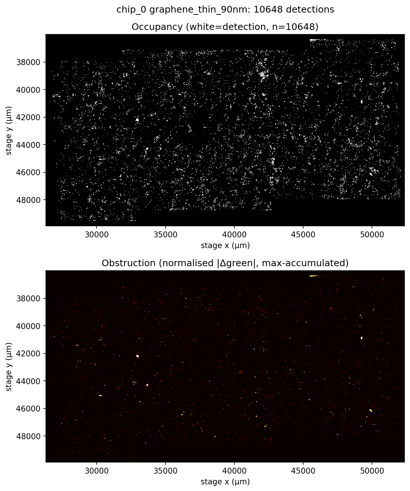

# FlakeFinder ranking metrics

Two extra per-candidate scores that sit on top of the existing FlakeFinder
pipeline. It already finds candidate flakes and revisits the good ones at 50x,
but the score it ranks them by doesn't really answer the two questions that
decide whether a flake is usable: how much of it is clean enough to stack, and
whether you can actually pick it up without the stamp clipping something next
to it.

I developed and tested these against two of the lab's run archives, the hBN run
(SF121 D-J) and the graphene run (Gr-260504). Between them that's 235
candidates across 8 chips.

**LHRR**, or Largest Homogeneous Rectangular Region, finds the biggest
axis-aligned rectangle you can fit inside a flake without hitting a defect.
This is worth doing because the existing global entropy/gradient score
penalises a flake for a dirty edge even when the interior is perfectly fine. A
4000 µm² flake with a contaminated rim can end up scoring below a 200 µm² clean
one, which is backwards if what you care about is stacking area.

**EOP**, or Ease of Pickup, looks at how much room a candidate has around it and
how prominent its neighbours are. A flake that's physically touching a thick
neighbouring detection is effectively unusable, because the stamp can't land on
it cleanly no matter how good the flake itself looks.

There's also a composite score combining the two, so the ranked CSV at the end
reflects usable area and pickup feasibility together rather than one or the
other.

> **What's in this repo.** Source, documentation, and a small sample of output.
> The lab's raw scan archives and flatfields aren't here, and neither is the
> full generated `outputs/` tree. Any numbers quoted below come from running
> the pipeline on the two archives above.
>
> Why each default is set the way it is, and the measurements behind it, are in
> [`docs/implementation-notes.md`](docs/implementation-notes.md). The plan I
> wrote before implementing anything is in
> [`docs/design-plan.md`](docs/design-plan.md).

---

## What the output looks like

This is `chip_0` of the graphene run, 4157 detections projected into stage
coordinates. The left panel is the occupancy map that clearance gets measured
against, the right panel is the obstruction map, where brighter means more
optical contrast against the substrate and so more of a pickup hazard.



And the top of the ranked CSV for that same run:

| rank | chip | label | lhrr_area_um2 | lhrr_quality_flag | clearance_um | eop_score | clearance_warning | composite_score |
|---|---|---|---|---|---|---|---|---|
| 1 | chip_0 | rank20_frame_0378_d5 | 112.713 | usable | 200.845 | 199.223 | False | 0.638394 |
| 2 | chip_0 | rank30_frame_0408_d21 | 109.077 | usable | 202.783 | 198.272 | False | 0.631542 |
| 3 | chip_0 | rank64_frame_0067_d31 | 99.727 | marginal | 187.953 | 186.260 | False | 0.589915 |
| 4 | chip_0 | rank07_frame_0069_d1 | 274.250 | usable | 98.860 | 97.093 | False | 0.580414 |
| 5 | chip_1 | rank25_frame_0357_d12 | 69.082 | marginal | 196.000 | 193.579 | False | 0.570657 |

Rank 4 is the interesting one. It has by far the largest clean rectangle in the
run at 274 µm², more than double anything above it, but it sits about half as
far from its nearest neighbour, so the EOP term drags it down to fourth. That
tradeoff is the whole point of the composite. Rank 3 shows the other half of
it: a perfectly well-placed flake that still flags `marginal`, because its
clean rectangle works out to a ~10 µm side, right at the graphene threshold.

[`examples/ranked_candidates_excerpt.csv`](examples/ranked_candidates_excerpt.csv)
has 15 rows sampled across the full ranking (top 8, middle, and bottom), which
between them cover every combination of `lhrr_quality_flag` and
`clearance_warning`. Stage coordinates are stripped from the excerpt; the real
output includes them.

---

## Requirements

Python 3.10 or later.

```
pip install -r requirements.txt
```

You'll also need the 10x flatfield `.npy` for your own microscope config. Pass
it with `--flatfield`; the constant `FLATFIELD_PATH` in
`src/flake_metrics.py` is only the fallback default.

---

## Running it

```
python src/flake_metrics.py path/to/run_dir [--flatfield path/to/flatfield.npy]
```

`run_dir` is the extracted root of one run archive. It handles one archive at a
time, so for both runs:

```
python src/flake_metrics.py data/_extracted/run_20260505_1616
python src/flake_metrics.py data/_extracted/run_20260504_1026
```

Each chip takes about 80 seconds to build its occupancy map, plus a few seconds
per candidate for LHRR, so budget somewhere in the range of 10 to 15 minutes
per run. Progress gets printed per chip as it goes.

---

## Using the results

The output you actually want is
`outputs/metrics/<run>_ranked_candidates.csv`, sorted descending by
`composite_score`. A reasonable way to work through it:

1. Filter to `clearance_warning == False`. Those are the candidates with at
   least 50 µm of clearance, so they're the safest immediate pickup targets.
2. Sort what's left by `composite_score`, or by `lhrr_area_um2` if you care
   more about raw usable area than overall quality.
3. Use `lhrr_quality_flag == "usable"` as a quick sanity check that the clean
   rectangle clears the material's area threshold.
4. For anything that looks promising, take the `label` field back to the
   original revisit images and to the chip occupancy image in `outputs/eop/`.

On these two datasets composite scores came out between 0.02 and 0.64. The
largest LHRR was 1219 µm² on the hBN side and 274 µm² on the graphene side, and
about 76% of candidates tripped `clearance_warning`. If your own results land
well outside those ranges, check the flatfield path first, then look at whether
the occupancy images make spatial sense.

### Column reference

| field | unit | meaning |
|---|---|---|
| `rank_in_run` | | 1-based rank by composite score inside this run |
| `chip` | | source chip directory |
| `material` | | material preset string from `seg/summary.json` |
| `label` | | revisit label, links back to the seg pipeline |
| `stage_x_um`, `stage_y_um`, `stage_z_um` | µm | 50x stage position |
| `lhrr_area_um2` | µm² | clean rectangle area, this is the LHRR ranking signal |
| `lhrr_fraction` | | LHRR area over total flake area, diagnostic only |
| `lhrr_quality_flag` | | `"usable"` or `"marginal"`, per material threshold |
| `lhrr_skip_reason` | | non-null if LHRR failed on that candidate |
| `clearance_um` | µm | distance to the nearest other detection |
| `weighted_obstruction` | | proximity-weighted area integral of contrast |
| `eop_score` | µm | `clearance_um / (1 + weighted_obstruction)` |
| `clearance_warning` | | True if `clearance_um < EOP_MIN_CLEARANCE_UM` |
| `eop_skip_reason` | | non-null if EOP failed on that candidate |
| `lhrr_area_norm` | [0,1] | `lhrr_area_um2` over the run-wide max |
| `eop_score_norm` | [0,1] | `eop_score` over the run-wide max |
| `composite_score` | [0,1] | `0.5 × lhrr_area_norm + 0.5 × eop_score_norm` |

One thing to keep in mind: `composite_score` is normalised by run-wide maxima,
so it isn't comparable across runs or across material presets. Use it to rank
within a run and nothing else.

### Chip-wide QC images

`outputs/eop/<run>_<chip>_occupancy.png` has two panels, the occupancy map with
every detection projected into stage coordinates, and the obstruction map
showing detection contrast as heat. It's worth looking at these before
trusting any EOP number, since scan tile boundaries, dust streaks and odd
density patterns all show up here and any of them can throw off individual
candidates.

---

## Tuning

Everything tunable is a module-level constant. Change the value, re-run.

### `src/lhrr.py`

| constant | default | meaning |
|---|---|---|
| `VARIANCE_PERCENTILE` | `50` | Percentile of interior variance used as the clean/dirty cutoff. Lower is stricter. |
| `VARIANCE_KERNEL_UM` | `5.0` | Spatial scale of the variance window. 5 µm is about 7 px at 10x. |
| `LHRR_USEFUL_THRESHOLD_UM_BY_MATERIAL` | `{hbn_medium: 20.0, graphene_thin_90nm: 10.0}` | Per-material minimum side length in µm for `"usable"`. |
| `DEFAULT_LHRR_USEFUL_THRESHOLD_UM` | `15.0` | Fallback for material presets that aren't in the dict. Prints a warning when it fires. |
| `LHRR_CLASSIFICATION_ALLOWLIST` | `{material: None}` | Per-material detection class filter. `None` accepts anything. |

The per-material thresholds are conservative starting points, not calibrated
numbers. They should get adjusted once you have a real sense of the smallest
clean rectangle your devices need.

### `src/eop.py`

| constant | default | meaning |
|---|---|---|
| `EOP_MIN_CLEARANCE_UM` | `50.0` | Threshold for `clearance_warning`, in µm. Lower it if a 76% warn rate is too broad to be useful. |
| `OCCUPANCY_STAGE_PX_UM` | `5.0` | Occupancy map resolution. Lowering it improves clearance precision but costs memory and time. |
| `MAX_OBSTRUCTION_RADIUS_UM` | `500.0` | How far out neighbours still count toward `weighted_obstruction`. |
| `BASELINE_SAMPLE_FRAMES` | `20` | Max frames used to estimate the substrate green baseline. |

### `src/flake_metrics.py`

| constant | default | meaning |
|---|---|---|
| `COMPOSITE_W_LHRR` | `0.5` | Weight on the LHRR term. |
| `COMPOSITE_W_EOP` | `0.5` | Weight on the EOP term. |

---

## Validation

Both metrics were checked against three size-representative hBN candidates from
chip_0 of the hBN run, at 505 µm², 978 µm² and 4556 µm². I picked those three
by actual area before writing any of the metric code, so they weren't chosen to
make the results look good.

For LHRR the variance threshold was tested at the 25th, 50th and 75th
percentile on each of the three. 50 is the default because it was the only one
that gave a contiguous clean mask covering the visually flat interior on all
three flakes. 25 broke the clean region into fragments and 75 let in edge
contamination that you can see in the figures.

EOP turned out to be resolution-invariant only after I corrected the
weighted-obstruction sum into a proper area integral. Before that fix the value
moved by roughly 25% across occupancy resolutions of 5, 2 and 1 µm/px. After
it, variation dropped to about 1 to 4% for candidates whose obstruction values
weren't near zero to begin with.

The pipeline is also deterministic. Re-running it on the graphene archive
produced byte-identical output.

All of that covers pipeline correctness. It does not show that a high LHRR and
a high EOP actually predict a successful device, and it can't. That would mean
comparing these rankings against real pickup outcomes, and that ground truth
sits with the lab.

---

## Limitations

**Composite scores are relative to their run.** Both normalised terms use
run-wide maxima, which means the top candidate in any run scores near 1.0 by
construction. Don't compare composites across runs or across material presets.

**About 76% of candidates trip `clearance_warning` on these datasets.** The
chips are dense and 50 µm is a conservative threshold. The flag is
informational by default, so flagged candidates still appear in the ranking and
their EOP score still separates them from each other. Lower
`EOP_MIN_CLEARANCE_UM` if you want the warning to be more selective.

**`clearance_warning = True` doesn't mean the composite is unreliable.** The
composite weights LHRR area and EOP equally, so a candidate with an unusually
large clean rectangle can still rank high even when it's crowded. If you want
pickup-safe candidates specifically, filter on the warn flag rather than
reading anything into the composite.

**`clearance_um = 5.0 µm` means touching, not 5 µm of breathing room.** When a
candidate's contour sits right up against another detection at sub-pixel
separation, the measured clearance pins to the occupancy map resolution floor,
which is 5 µm at the default setting. For those candidates the absolute number
isn't meaningful and `clearance_warning` is the field to use.

**LHRR gets less reliable on very small flakes.** Once a candidate's bounding
box approaches the size of the variance kernel (5 µm, so about 7 px at 10x),
the variance map starts describing the kernel footprint more than the actual
surface. Treat `lhrr_quality_flag` as advisory for anything below roughly
50 µm² of LHRR.

**The occupancy build is slow.** Reading and flatfield-correcting every 10x
frame on a chip takes around 80 seconds at the default 5 µm/px. If a run needs
reprocessing, re-running LHRR on its own without rebuilding occupancy is much
faster.

---

## How it works

### LHRR

First the raw 10x JPEG gets a per-pixel multiplicative flatfield correction to
take out the illumination pattern, and the flake mask is rebuilt by filling the
contour that the segmentation JSON already stores. Then local variance is
computed on the green channel using the standard box-filter identity,
`E[X²] - E[X]²`, which keeps it linear in the number of pixels. The kernel is
specified in microns rather than pixels so it stays physically meaningful,
defaulting to 5 µm, which works out to about 7 px given the Leica K5C's
0.72 µm/pixel at 10x.

One detail that matters here: the variance map is computed over a dilated
version of the mask so that pixels near the flake edge still get a full kernel
neighbourhood, but the percentile threshold is sampled only from the strict
interior. Pixels sitting on the boundary have roughly 2.8 times the mean
variance of interior pixels, so including them drags the threshold toward edge
artifacts instead of describing the actual surface. The clean mask is then
every interior pixel below that threshold.

Finding the largest axis-aligned rectangle inside the clean mask is done by
reducing it row by row to the largest-rectangle-in-histogram problem, which a
stack-based pass solves in O(rows × cols). I went with axis-aligned
deliberately, since that's the geometry the stamp actually has.

### EOP

Every segmentation detection from every 10x frame on the chip gets projected
out of pixel space into physical stage coordinates, using the per-frame stage
metadata and the same 0.72 µm/pixel scale, mapped linearly relative to the
frame centre. Those all go into one chip-wide occupancy map at 5 µm/px.

To get a sense of how prominent each neighbour is, the substrate's green
intensity is estimated per chip by sampling up to 20 frames, masking out every
detection in them, and taking the mean of what's left. Each detection's
contrast delta against that baseline is then normalised by the chip-wide
maximum, giving an obstruction weight between 0 and 1. Worth being clear about
what this is: on a 90 nm SiO2 substrate, optical contrast isn't monotonic in
flake thickness because of thin-film interference, so this is a
visibility-based proxy for obstruction risk and not a real height measurement.

Clearance is measured by temporarily removing the candidate from the occupancy
map, running a distance transform on the inverted result, and sampling that at
the candidate's outer boundary. The total weighted obstruction is an area
integral over all non-candidate detections inside a maximum radius, falling off
as one over distance squared. Multiplying the sum by the physical pixel area is
what makes it behave as an actual area integral, and that's what keeps the
score from drifting when the occupancy resolution changes.

---

## Folder layout

```
flakefinder-ranking-metrics/
├── README.md
├── LICENSE
├── requirements.txt
├── docs/
│   ├── design-plan.md            plan written before implementation
│   └── implementation-notes.md   decisions made while implementing
├── examples/
│   ├── occupancy_graphene_chip_0.png    sample chip-wide QC image
│   └── ranked_candidates_excerpt.csv    15 rows sampled from a real run
├── src/
│   ├── flake_metrics.py          main entrypoint
│   ├── run_all_metrics.py        runs both archives back to back
│   ├── lhrr.py                   LHRR metric
│   ├── eop.py                    EOP metric
│   ├── io_utils.py               shared I/O helpers
│   ├── recon.py                  dataset recon and flatfield check
│   ├── qc_run.py                 10-check QC harness
│   ├── validate_lhrr.py          LHRR validation figures
│   ├── validate_eop.py           EOP validation figures
│   ├── sweep_lhrr_percentile.py  variance percentile sweep
│   ├── diag_*.py                 diagnostics used while developing
│   └── _check_seg.py             debug tool, dumps seg JSON schema for a chip
│                                 usage: python src/_check_seg.py <chip_dir>
└── outputs/                      generated at runtime, not in the repo
    ├── metrics/                  ranked CSVs and per-chip JSON
    └── eop/                      chip-wide occupancy QC images
```

---

## License

MIT, see [LICENSE](LICENSE). The sample output under `examples/` is derived
from the lab's scan data and is included with their permission.
